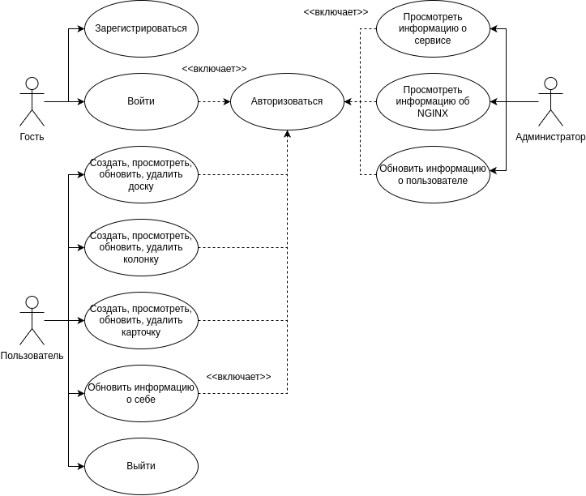
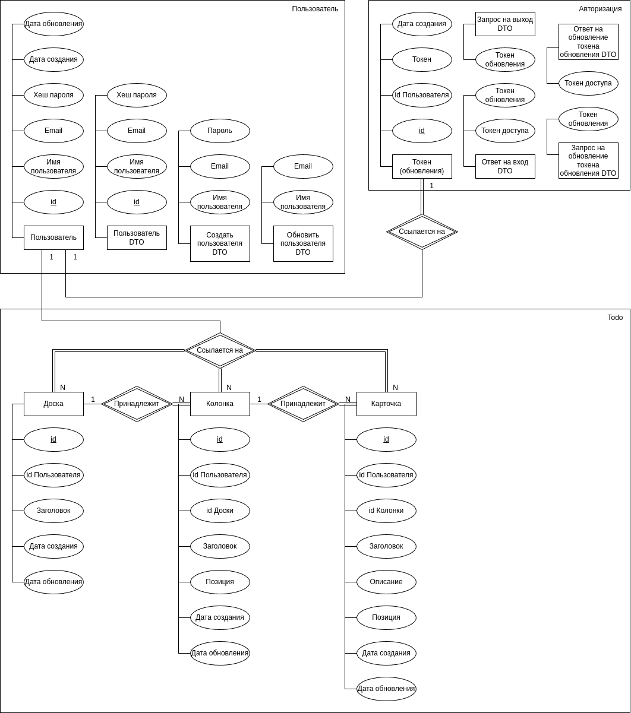
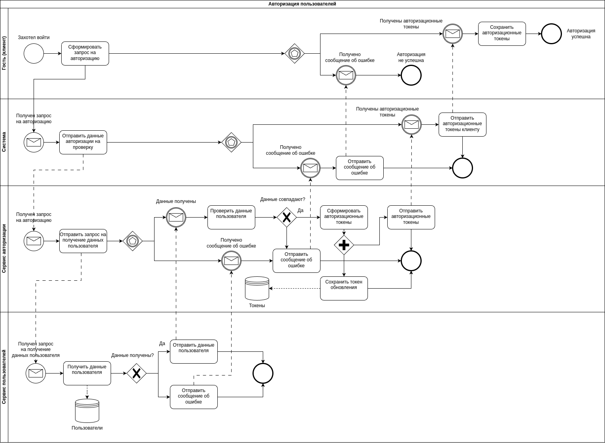
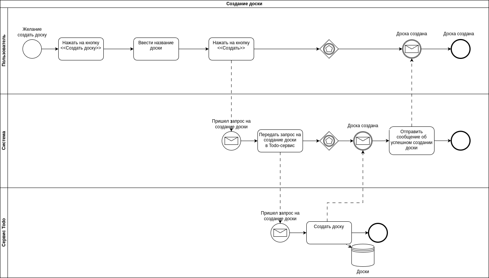
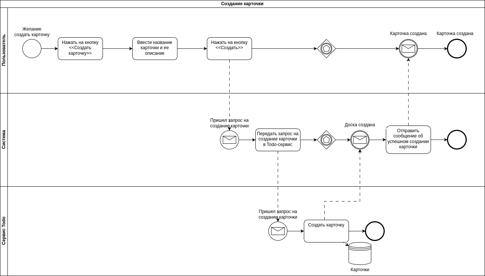
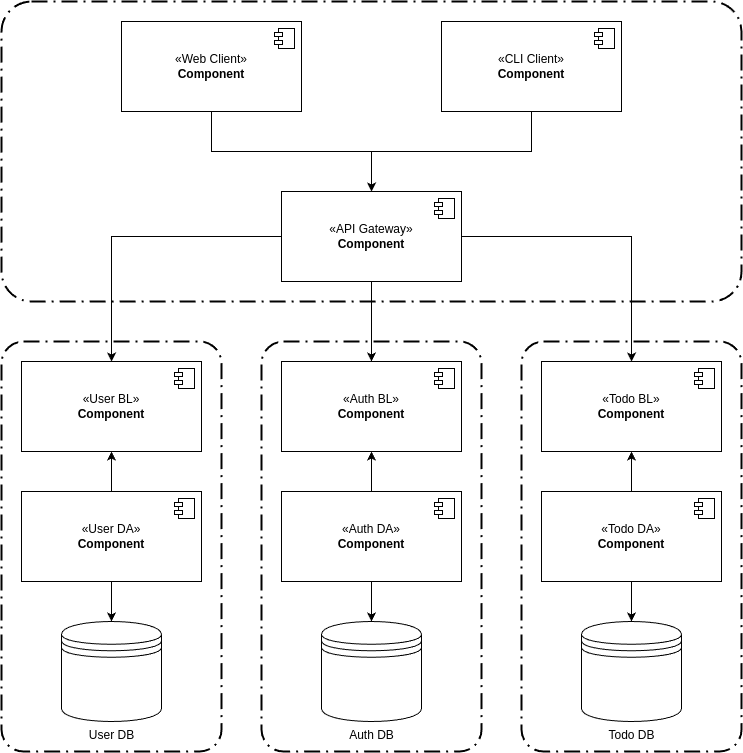
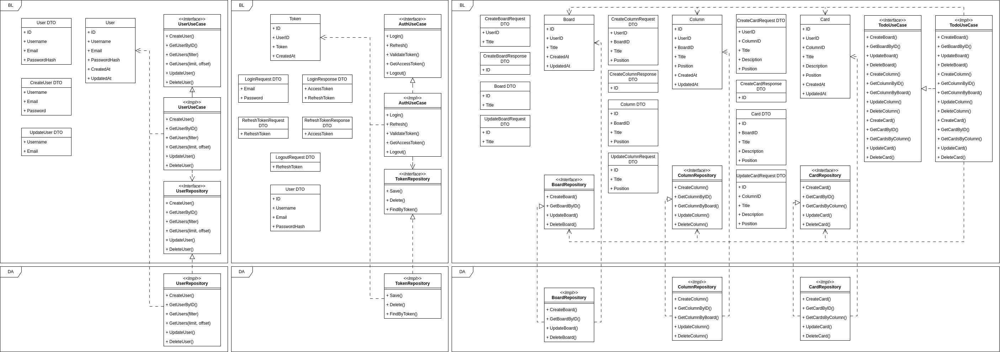

# Интегратор сервисов (и сервис --- доска TODO)

## Краткое описание идеи проекта
<!-- 1 абзац, 3 предложения -->
Интегратор сервисов --- приложение для прохождения лабораторных практикумов по курсам ППО, WEB и Тестированию ПО.
Приложение представляет собой API Gateway с Web и CLI интерфейсом, а также несколько микросервисов: user, auth и todo.
User отвечает за хранение данных пользователей, Auth - за хранение и выдачу токенов, Todo - доска типа Trello.
Приложение позволяет легко добавлять новые сервисы и сценарии использования.

## Краткий анализ аналогичных решений
<!-- 1 таблица, 3 критерия -->
| Критерий | IFTTT | Zapier | ClickUp | Интегратор сервисов |
| - | - | - | - | - |
| Позволяет налаживать взаимодействие популярных сервисов между собой | + | + | + | + |
| Позволяет объединять пользовательские сервисы | - | - | - | + |
| Возможность использования через терминал | - | - | - | + |

## Краткое обоснование целесообразности и актуальности проекта
Данный проект актуален, так как является фундаментом для прохождения лабораторных практикумов сразу по трем дисциплинам, и позволяет легко вносить правки разного плана: добавление нового сервиса, добавление нового интерфейса взаимодействия с API Gateway, добавление нового сценария использования и т.д.

## Краткое описание акторов (ролей)
### Администратор
- Возможность выполнять все сценарии использования каждого сервиса
- Возможность обновлять информацию о пользователях сервисов
- Возможность просмотра оперативной статистики по количеству созданных карточек и пользователей за выбранный временной промежуток

### Гость
- Возможность авторизоваться
- Возможность просмотра доски сервиса TODO по ссылке
- Возможность просмотра детальной информации о карточках на открытой доске сервиса TODO

### Пользователь
- Возможность перейти на страницу сервиса TODO (упрощенная версия Trello)
- Возможность создать/просмотреть/обновить/удалить доску
- Возможность создать/просмотреть/обновить/удалить колонку на доске
- Возможность создать/просмотреть/обновить/удалить карточку на колонке
- Возможность создать/просмотреть/обновить/удалить детальную информацию о карточке
- Возможность лог-аута

## Use-Case диаграмма

## ER-диаграмма сущностей

## Пользовательские сценарии
<!-- не менее 3 типовых сценариев, в текстовом виде, расписанных по шагам, для разных акторов -->
### Сценарий 1: Регистрация пользователя (сложный, проверка надежности пароля)
1. Гость переходит на страницу регистрации.
2. Гость вводит свою электронную почту, имя пользователя и пароль.
3. Гость нажимает кнопку <<Зарегистрироваться>>.
4. Данные отправляются на проверку сервису User.
5. Сервис User проверяет уникальность введенных электронной почты и имени пользователя в своей базе данных.
6. Сервис User проверяет надежность пароля.
7. Если пароль надежен, он хешируется и данные пользователя добавляются в базу данных.
8. Гость получает сообщение об успешной регистрации и перенаправляется на страницу авторизации.

### Сценарий 2: Авторизация пользователя
1. Гость вводит свои логин и пароль.
2. Гость нажимает кнопку <<Войти>>.
3. Данные отправляются на проверку сервису Auth.
4. Сервис Auth отправляет запрос на получение данных пользователя с введенным логином в сервис User.
5. Сервис User отправляет данные пользователя, если он есть в базе данных.
6. Сервис Auth проверяет совпадение хешей введенного пароля и пароля, хранящегося в базе данных.
7. Если пароли совпадают, сервис Auth генерирует токен доступа, и токен обновления для пользователя.
8. Сервис Auth сохраняет токен обновления в своей базе данных.
9. Токены сохраняются в Cookie, если клиент --- браузер, и в файле, если клиент --- терминал.
10. Гость становится Пользователем.

### Сценарий 3: Авторизация с помощью токена
1. Гость заходит на сайт, отправляя вместе с запросом свой токен доступа.
2. API Gateway отправляет токен доступа на проверку в Auth сервис.
3. В случае успеха, Auth сервис возвращает идентификатор пользователя.
4. В случае истечения срока действия токена, Auth сервис отправляет запрос на получение токена обновления.
5. API Gateway отправляет токен обновления на проверку в Auth сервис.
6. В случае успеха, Auth сервис возвращает токен доступа и идентификатор пользователя.
7. Клиент обновляет токен доступа в Cookie или файле.
8. API Gateway проверяет, хватает ли прав доступа пользователя для выполнения запроса.
9. Если прав доступа хватает, API Gateway позволяет выполнить запрос.

### Сценарий 4: Создание карточки, колонки и доски
1. Пользователь заходит на страницу сервиса Todo.
2. Пользователь нажимает <<Новая доска>>.
3. Пользователь вводит заголовок доски.
4. Пользователь отмечает флаг общедоступности доски.
5. Пользователь нажимает кнопку <<Создать>>.
6. Пользователь переходит на страницу созданной доски.
7. Пользователь нажимает <<Новая колонка>>.
8. Пользователь вводит заголовок колонки.
9. Пользователь нажимает <\<Enter\>>.
10. Пользователь нажимает <<Новая карточка>>.
11. Пользователь вводит заголовок карточки.
12. (Опционально) Пользователь вводит описание карточки.
13. Пользователь нажимает <\<Enter\>>.
14. Карточка создана.

### Сценарий 5: Просмотр оперативной статистики (сложный)
1. Администратор заходит в админ-панель.
2. Администратор задает временной промежуток.
3. Администратор нажимает <<Получить статистику>>.
4. Администратор получает информацию о 1) количестве новых пользователей за указанный временной промежуток; 2) количестве созданных карточек за указанный временной промежуток; 3) количестве карточек, созданных новыми пользователями.

## Формализация ключевых бизнес-процессов
<!-- либо один основной комплексный бизнес процесс, либо 3-4 декомпозированных, небольших, используя BPMN-нотацию -->

### Авторизация

### Создание доски

### Создание карточки

## Описание типа приложения

Тип приложения:
- WebSPA, CLI

Технологический стек:
- Web Frontend: HTML + CSS + TS (React)
- CLI Frontend: Bubbletea
- Backend: Golang + PostgreSQL

## Верхнеуровневое разбиение на компоненты

## UML диаграмма классов для компонентов бизнес логики и доступа к данным

